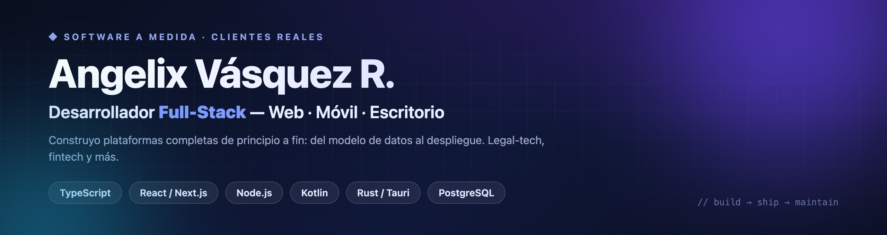

  

  

  

---

## 👋 Sobre mí

Soy **Angelix Vásquez R.**, desarrollador **full-stack** enfocado en construir productos completos y reales — no demos. Llevo proyectos de principio a fin: **arquitectura → backend → frontend → despliegue → mantenimiento**.

- 🧩 Construyo en 3 frentes: **web** (React/Next.js), **móvil** (Android/Kotlin) y **escritorio** (Tauri/Rust).
- ⚖️ Experiencia en **legal-tech** y 💸 **fintech**, con software en producción para clientes.
- 🌱 Siempre aprendiendo y refinando arquitecturas limpias (MVVM, capas, tipado estricto).
- 📫 Escríbeme: **Angelixvrobles1234@outlook.com**

---

## 🛠️ Stack

**Lenguajes**

  
  
  
  

**Frontend**

  
  
  
  

**Backend & Datos**

  
  
  
  
  

**Plataformas & Herramientas**

  
  
  
  

---

## 🚀 Proyectos destacados

> Vitrinas de proyectos reales. El código de los productos de cliente es privado; aquí muestro qué construí, con capturas y stack.

| Proyecto | Qué es | Stack |
|---|---|---|
| ⚖️ **[Sistema Legal](https://github.com/AngelixVrobles/sistema-legal-showcase)** | Plataforma para bufetes: biblioteca jurídica + expedientes | Next.js · Prisma · PostgreSQL |
| 📂 **[Expedientes Legales](https://github.com/AngelixVrobles/expedientes-polanco-showcase)** | Gestión de expedientes white-label, multi-cliente | Next.js · Prisma · Docker |
| 📊 **[VAULT — Financial Command Center](https://github.com/AngelixVrobles/finanzasj-showcase)** | App de escritorio de gestión patrimonial | Tauri · React · Rust |
| 🚐 **[AlexYah Transportation](https://github.com/AngelixVrobles/alexyah-showcase)** | Sitio + reclutamiento de conductores + panel admin | Node.js · Express |
| 🎮 **[RegJugadores](https://github.com/AngelixVrobles/RegJugadores)** | App Android (jugadores, partidas, logros + Tic-Tac-Toe) | Kotlin · Compose · Room |

---

## 🧠 Lenguajes más usados

> Distribución real considerando todos mis proyectos (incluidos los privados).

  
  
  
  
  

## 📊 Estadísticas

  

  

ℹ️ Las tarjetas automáticas solo cuentan repos <b>públicos</b>; la mayor parte de mi trabajo está en repos privados de clientes.

---

## 🤝 Conecta

  
  
  

<!-- 👆 Actualiza el enlace de LinkedIn con tu URL real -->

